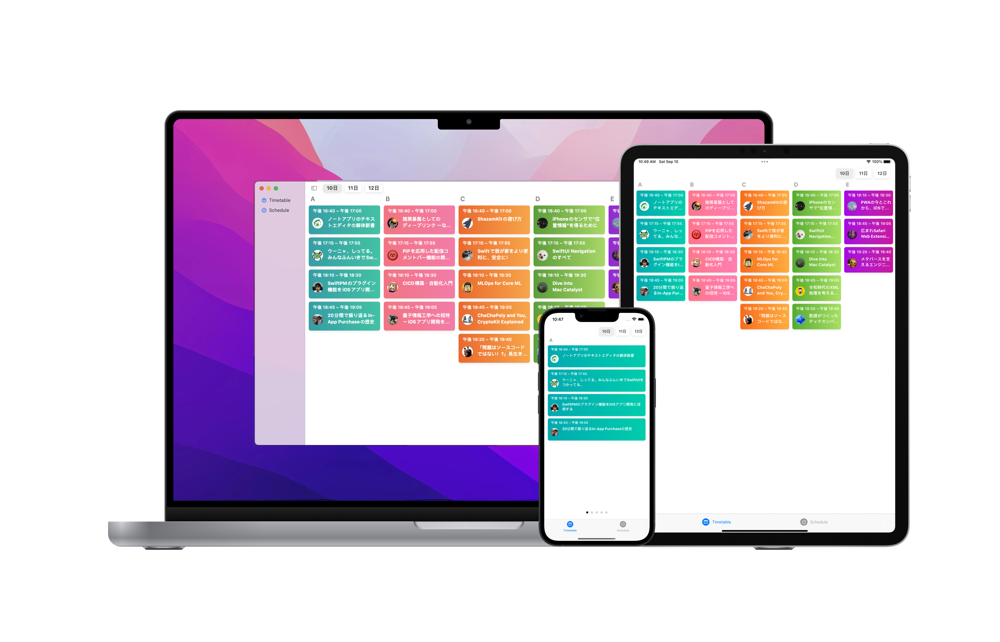

# iOSDC2022-SwiftUI-TCA

This is a timetable application for **[iOSDC2022](https://iosdc.jp/2022/)** which is a technical conference for iOS developer in Japan, It is also a learning project for myself to study **[TCA](https://github.com/pointfreeco/swift-composable-architecture)** and macOS development by using SwiftUI. It contains the function for displaying the timetable and make you own schedule for the event.

## Dependency
It only introduced the [TCA](https://github.com/pointfreeco/swift-composable-architecture) through SPM, so there is no need to install other tools for install 3rd party libraries.

## Requirements
* Xcode14
* iOS16
* macOS13
 
 Feel free to add any comment or issue report
